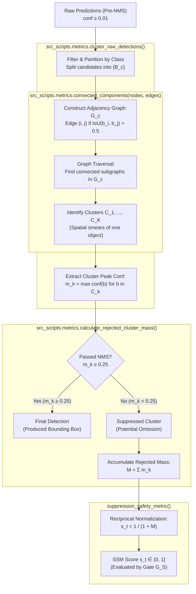

# Hierarchical Inference Learning for Edge Object Detection

An adaptive offloading framework that dynamically routes object detection tasks between a local Small Model (**YOLOv8n**) and a remote Large Model (**YOLOv8x**) using the Hierarchical Inference Learning with Feedback (**HIL-F**) algorithm. Evaluated on the 5,000-image COCO 2017 validation set.

---

## Quickstart

```bash
# 1. Setup environment
python3 -m venv .venv
source .venv/bin/activate
pip install -r requirements.txt

# 2. Download COCO 2017 val images & annotations (~1.5 GB)
./download_coco_dataset.sh

# 3. Precompute YOLO inferences once (required for simulations)
python3 -m src_scripts.precompute
python3 -m src_scripts.precompute_raw
```

> **Note:** Model weights (`yolov8n.pt` and `yolov8x.pt`) are automatically downloaded by Ultralytics on the first precomputation run.

---

## Replicating Thesis Results

### 1. Interactive Notebook
Launch [`thesis_replication.ipynb`](thesis_replication.ipynb) to view and execute a 1-to-1 replication of all figures and tables from the report:
```bash
jupyter notebook thesis_replication.ipynb
```

### 2. Thesis Tables CLI
Run the dedicated table reproduction scripts inside `analysis_scripts/`. Add `--latex` to output LaTeX `tabular` code matching the thesis:

| Table | Content | Script |
|---|---|---|
| **Table II** | Policy Performance Comparison | `python3 analysis_scripts/create_performance_table.py` |
| **Table III** | Decision Performance Breakdown | `python3 analysis_scripts/create_decision_performance_table.py` |
| **Table IV** | Failure Modes (Naive HIL-F) | `python3 analysis_scripts/create_failure_mode_table.py` |
| **Tables V & VI** | Dual-Gate (Global) Analysis | `python3 analysis_scripts/create_dual_gate_global_tables.py` |
| **Tables VII & VIII** | Dual-Gate (Specialized) Analysis | `python3 analysis_scripts/create_dual_gate_specialized_tables.py` |

---

## Running Offloading Simulations

Simulations evaluate offloading policies on the cached detections in seconds without re-running YOLO:

```bash
# Naive HIL-F (Weakest Link confidence)
python3 simulation_scripts/run_hilf_naive.py

# Standalone SSM policy
python3 simulation_scripts/run_hilf_ssm.py

# Dual-Gate with Global Feedback (same binary Y_t cost)
python3 simulation_scripts/run_hilf_dual_gate_global_cost.py

# Dual-Gate with Specialized Feedback (Gate 1: FP, Gate 2: FN)
python3 simulation_scripts/run_hilf_dual_gate_specialized_cost.py
```

Results are saved to `results/` and preserve backwards compatibility with the reported thesis numbers.

---

## Repository Map

```text
├── analysis_scripts/      # Scripts recreating Tables II through VIII
├── datasets/              # COCO 2017 val images & annotations
├── figures/               # Generated figures and visual comparisons
├── report/                # LaTeX report source (report-clean/) and compiled PDF
├── results/               # Reference evaluation CSVs behind thesis tables
├── simulation_scripts/    # Offloading policies (Naive, SSM, Dual-Gate) where their results get cached in results/
├── src_scripts/           # Core HIL-F algorithm, metrics (Weakest Link, SSM), precompute
├── visualization_scripts/ # Creates visualizations and figures to aid in understanding the detection models and the offloading policies
└── thesis_replication.ipynb # Self-contained end-to-end results reproduction notebook
```

---

### Suppression Safety Metric (SSM) in `src_scripts/metrics.py` explaination

The SSM heuristic captures potential False Negatives (missed objects) by grouping raw, pre-NMS candidate boxes into connected components and measuring the mass of unconfirmed detections:




---

## System Requirements

- **Python:** 3.9+
- **Hardware:** Apple Silicon (M-series / MPS) or NVIDIA GPU (CUDA) recommended for the one-time YOLO precomputation; simulations run quickly on standard CPUs.
- **Storage:** ~25 GB total if caching both standard (`~11 GB`) and raw pre-NMS (`~11 GB`) predictions for all 5,000 COCO validation images.
